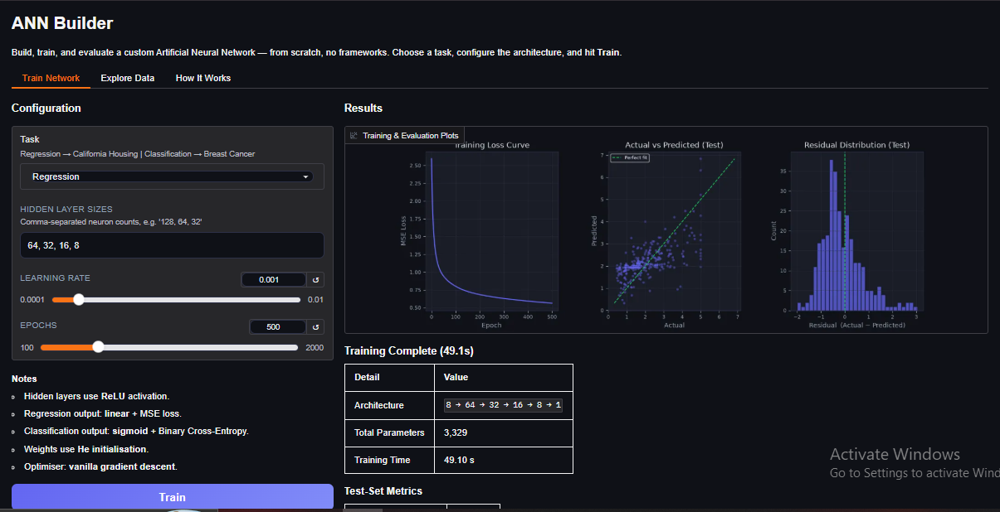
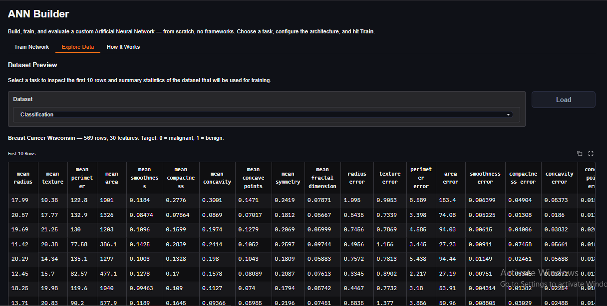

# Building an Artificial Neural Network from Scratch
A comprehensive implementation of a fully-connected Artificial Neural Network using NumPy only — no TensorFlow, no PyTorch, no Keras. Every component, from weight initialisation to backpropagation, is written explicitly so you can see exactly what deep learning frameworks do under the hood.

- Neural Network Built Completely by me without any outside help.
- Gradio UI Code written by Claude.

## Table of Contents

1. [Overview](#overview)
2. [Learning Objectives](#learning-objectives)
3. [Prerequisites](#prerequisites)
4. [Project Structure](#project-structure)
5. [Setup and Run](#setup-and-run)
6. [Screenshots](#screenshots)
7. [How to Use the App](#how-to-use-the-app)
8. [Core Concepts Explained](#core-concepts-explained)
9. [Practice Exercises](#practice-exercises)
10. [Troubleshooting](#troubleshooting)
11. [Further Learning](#further-learning)

## Overview

This project provides a complete implementation of an Artificial Neural Network built from scratch. You will learn how neural networks work at the lowest level by building every piece yourself, then interact with the trained network through a clean Gradio UI.

### What You Will Build

- A fully functional multi-layer neural network
- Support for both regression and classification tasks
- Custom activation functions (ReLU, Sigmoid, Linear)
- Forward and backward propagation algorithms
- A training loop with loss tracking and live progress
- An interactive UI to configure, train, and evaluate the network

## Learning Objectives

By completing this tutorial, you will:

1. Understand the mathematics behind neural networks
2. Implement forward propagation to make predictions
3. Implement backward propagation to learn from errors
4. Master the chain rule for gradient computation
5. Build intuition about weight matrices and bias vectors
6. Train models on real-world datasets
7. Debug and optimise neural network performance

## Prerequisites

### Required Knowledge

- Python: Intermediate level (functions, control flow, NumPy)
- Linear Algebra: Matrix multiplication, dot products
- Calculus: Derivatives and the chain rule (basic understanding)
- Machine Learning: Basic concepts such as train/test splits and loss functions

### Required Libraries

```python
import numpy as np
import pandas as pd
import matplotlib.pyplot as plt
from sklearn.datasets import fetch_california_housing, load_breast_cancer
from sklearn.model_selection import train_test_split
import gradio as gr
```

## Project Structure

```
.
├── network.py                  # Core ANN: activations, forward, backward, training
├── main.py                     # Gradio UI: configure, train, evaluate, explore data
├── requirements.txt            # All dependencies
├── README.md                   # This file
└── docs/
    ├── output1.PNG             # Screenshot: Training results tab
    └── output2.PNG             # Screenshot: Data exploration tab
```

### File Responsibilities

`network.py` contains every mathematical component of the neural network: activation functions and their derivatives, loss functions, He initialisation, the forward pass, the backward pass, the gradient descent update step, the training loop, and evaluation helpers for both regression and classification.

`main.py` imports from `network.py` and builds the Gradio UI. It handles data loading, preprocessing, user input, progress reporting, plot generation, and metrics display. Running this file launches the app.

## Setup and Run

### Step 1: Clone the repository

```bash
git clone <your-repo-url>
cd <repo-folder>
```

### Step 2: Create and activate a virtual environment

```bash
python -m venv .venv
```

On macOS and Linux:
```bash
source .venv/bin/activate
```

On Windows:
```bash
.venv\Scripts\activate
```

### Step 3: Install dependencies

```bash
pip install numpy pandas matplotlib scikit-learn gradio
```

Or, if a `requirements.txt` is already present:

```bash
pip install -r requirements.txt
```

### Step 4: Generate requirements.txt (first-time setup only)

```bash
pip freeze > requirements.txt
```

### Step 5: Run the app

```bash
python main.py
```

The terminal will print a local URL, typically `http://127.0.0.1:7860`. Open it in your browser.

## Screenshots

### Training Results



After configuring the network and clicking Train, you will see a live progress bar followed by three diagnostic plots and a metrics summary. For regression these are: loss curve, actual vs predicted scatter, and residual distribution. For classification: loss curve, predicted probability distribution, and a confusion matrix.

### Data Exploration



The Explore Data tab lets you inspect the first 10 rows of whichever dataset is selected. Switch between California Housing (regression) and Breast Cancer Wisconsin (classification) using the dropdown. The table updates instantly.

## How to Use the App

The app has three tabs: Train Network, Explore Data, and How It Works.

### Train Network Tab

This is the main tab. Use it to configure and run training.

**Task dropdown** — Select Regression or Classification. This determines which dataset is loaded and which loss function is used. Regression uses the California Housing dataset with MSE loss. Classification uses the Breast Cancer Wisconsin dataset with Binary Cross-Entropy loss.

**Hidden Layer Sizes** — Enter a comma-separated list of neuron counts for the hidden layers, for example `64, 32, 16`. The input and output dimensions are set automatically based on the dataset. You can make the network as shallow as `32` (one hidden layer) or as deep as `128, 64, 64, 32, 16` (five hidden layers). All hidden layers use ReLU activation.

**Learning Rate** — Controls how large each gradient descent step is. The slider ranges from 0.0001 to 0.01. A value of 0.001 is a reliable starting point for most configurations. If the loss curve is unstable or oscillating, lower it. If training is very slow to converge, try increasing it slightly.

**Epochs** — The number of full passes through the training data. The slider ranges from 100 to 2000. More epochs give the network more opportunity to learn but take longer. Watch the loss curve: if it has already flattened before the epoch count is reached, the extra epochs are not contributing.

**Train button** — Starts training. A live progress bar shows the current epoch and loss value. Once complete, three plots appear on the right along with a metrics table showing architecture summary, parameter count, training time, and test-set performance.

### Explore Data Tab

Select a dataset from the dropdown to preview its first 10 rows in a scrollable table. The table updates automatically when you change the dropdown. Use this tab to understand the feature names, value ranges, and target column before training.

### How It Works Tab

A detailed reference covering all 11 components of the network: data preprocessing, architecture, He initialisation, activation functions, forward pass, loss functions, backpropagation, gradient descent, the training loop, evaluation metrics, and dataset descriptions. Read this tab alongside the code in `network.py` for the clearest understanding.

## Core Concepts Explained

### Weights and Bias Matrix

Think of weights as importance multipliers and biases as constant offsets. Each connection between neurons has a weight that determines how strongly one neuron influences the next.

For N input features feeding into M neurons, the weight matrix W has shape `(N, M)` and the bias vector b has shape `(1, M)`. He initialisation sets starting weights to:

```
W = Normal(mean=0, std=sqrt(2 / N))
```

The factor of 2 compensates for ReLU zeroing out roughly half of all values.

### Activation Functions

**ReLU** is used in all hidden layers:
```python
def relu(x):
    return np.maximum(0, x)
```
Positive values pass through unchanged. Negative values become zero. This non-linearity is what allows the network to learn patterns that cannot be captured by a straight line.

**Sigmoid** is used at the output layer for classification:
```python
def sigmoid(x):
    return 1 / (1 + np.exp(-x))
```
Squashes any real number into the range (0, 1), making the output directly interpretable as a probability.

**Linear (identity)** is used at the output layer for regression — the neuron outputs its weighted sum with no transformation, allowing any real-valued prediction.

### Forward Propagation

For each layer i, two operations happen in sequence:
```
Z[i] = A[i-1] · W[i] + b[i]    (weighted sum)
A[i] = activation(Z[i])          (non-linear transformation)
```
The output of each layer becomes the input of the next. Both Z and A are cached at every layer because backpropagation needs them.

### Loss Functions

**MSE** for regression:
```
Loss = (1/n) * sum((y_true - y_pred)^2)
```

**Binary Cross-Entropy** for classification:
```
Loss = -(1/n) * sum(y_true * log(y_pred) + (1 - y_true) * log(1 - y_pred))
```

### Backward Propagation

Starting at the output and working backwards, the gradient of the loss with respect to every weight is computed using the chain rule. Each layer's weight gradient is:
```
dL/dW[i] = A[i-1].T · dL/dZ[i]
```
where `dL/dZ[i]` is obtained by multiplying the upstream gradient by the local activation derivative.

### Gradient Descent

After gradients are computed, every weight and bias is updated:
```
W = W - learning_rate * dL/dW
b = b - learning_rate * dL/db
```
This nudges every parameter in the direction that reduces the loss. Repeat for every epoch.

## Practice Exercises

### Beginner

1. Modify the hidden layer sizes. Start with a single layer `32`, then try `64, 32`, then `128, 64, 32`. Observe how training time and test metrics change.
2. Experiment with the learning rate. Try 0.0001, 0.001, and 0.005. Watch how the slope and stability of the loss curve change.
3. Compare shallow vs deep networks with the same total number of neurons. For example, `256` vs `64, 64, 64, 64`.

### Intermediate

4. Open `network.py` and read the `backward` function. Trace through each line and match it to the chain rule formula in the How It Works tab.
5. Add a validation split inside `network.py`. Compute and return validation loss at each epoch alongside training loss, then plot both curves.
6. Implement early stopping: stop training if the loss has not improved by more than 1e-4 for 50 consecutive epochs.

### Advanced

7. Implement momentum: instead of using the raw gradient, accumulate a moving average of gradients and use that for the update.
8. Add L2 regularisation: add a penalty term `lambda * sum(W^2)` to the loss and include the corresponding term `lambda * W` in the weight gradients.
9. Extend the network to support multi-class classification using Softmax activation and categorical cross-entropy loss.

## Troubleshooting

### Loss becomes NaN during training

This usually means the learning rate is too high, causing weights to grow until operations overflow. Reduce the learning rate to 0.0001 or lower. If the problem persists, check whether the input data is properly standardised — unstandardised features with large magnitudes are a common cause.

### Loss is not decreasing

The learning rate may be too low, or the network may be too shallow to capture the patterns in the data. Try increasing the learning rate slightly or adding more hidden layers and neurons. Also verify that the correct dataset is loaded for the selected task.

### Loss decreases on training but test metrics are poor

This is overfitting. The network has memorised the training data rather than learning generalisable patterns. Try reducing the number of neurons or hidden layers. Adding a validation split (see Practice Exercise 5) will make overfitting visible during training rather than only at evaluation time.

### App does not launch

Confirm the virtual environment is activated and that all dependencies are installed. Run `pip list` and verify that `gradio`, `numpy`, `scikit-learn`, `pandas`, and `matplotlib` are present. If Gradio reports a port conflict, add `server_port=7861` to `app.launch()` in `main.py`.

## Further Learning

### Recommended Next Steps

After understanding this implementation, rebuild the same network in a framework to see how the abstractions map to what you wrote here:

- TensorFlow / Keras: the `Dense` layer, `compile`, `fit` and `evaluate` methods correspond directly to the functions in `network.py`
- PyTorch: `nn.Linear`, `forward` methods, and `optimizer.step()` map to the same mathematical steps

### Concepts to Study Next

- Gradient descent variants: SGD with momentum, RMSprop, Adam
- Regularisation techniques: L1, L2, dropout, early stopping
- Batch normalisation: stabilises training of very deep networks
- Learning rate schedules: reduce the learning rate as training progresses
- Advanced architectures: Convolutional Neural Networks (CNNs) for images, Recurrent Neural Networks (RNNs) for sequences, Transformers for language

### Suggested Datasets to Try

- MNIST: 70,000 handwritten digit images, 10-class classification
- Iris: 150 samples, 4 features, 3-class classification — good for implementing Softmax
- Your own tabular CSV: standardise the features, define a layer architecture, and train

## License and Attribution

This project is for educational purposes. Free to use, modify, and share with attribution.
